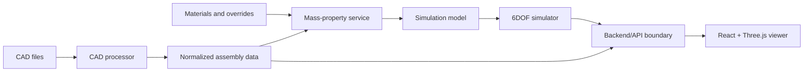

# Architecture

## Current Architecture

The current repository is documentation plus one CAD fixture. There is no
runtime architecture yet.

Current directories:

- `cad/`: stores CAD input files. Currently contains one STEP assembly fixture.
- `docs/`: stores versioned documentation.
- `scripts/`: stores documentation support scripts.

Directories that do not exist yet:

- Frontend directory.
- Backend directory.
- CAD-processing package.
- Simulation package.
- C++ service directory.
- Test directory.
- Infrastructure, CI, deployment, or container configuration.

## Planned Architecture

The intended architecture should keep CAD processing, physics simulation,
backend APIs, and rendering separated.



## CAD Boundary

Initial CAD work is expected to use Python with CadQuery and lower-level
OCP/Open CASCADE bindings. Code outside the CAD package should consume
normalized project data instead of direct CadQuery or Open CASCADE objects.

Target interface:

```python
class CadProcessor:
    def import_assembly(self, path: str): ...
    def calculate_mass_properties(self, assembly, materials): ...
    def create_render_mesh(self, assembly): ...
```

If a C++ Open CASCADE service is added later, it should preserve this boundary
at the API level.

## Normalized Data Direction

CAD and simulation outputs should use explicit SI-unit fields:

```json
{
  "parts": [
    {
      "id": "battery",
      "name": "Battery",
      "material_id": null,
      "volume_m3": 0.00012,
      "mass_kg": 0.42,
      "mass_source": "manufacturer_override",
      "center_of_mass_m": [0.0, -0.04, -0.02],
      "transform": []
    }
  ],
  "total_mass_kg": 1.82,
  "center_of_gravity_m": [0.01, -0.004, -0.03],
  "inertia_tensor_kg_m2": []
}
```

This is an architectural target, not an implemented schema in v0.1.0.

## Data Flow

Planned data flow:

1. CAD file is imported and validated.
2. Assembly parts are normalized.
3. Materials and mass overrides are applied.
4. Part mass properties are calculated.
5. Aggregate center of gravity and inertia tensor are calculated.
6. Simulation model is assembled from frame, motor, propeller, battery, and
   aerodynamic parameters.
7. Simulator emits time-stamped state.
8. Frontend renders meshes, overlays, and motion from normalized data.

## Coordinate Systems And Units

- Internal calculations should use SI units unless an external format requires
  otherwise.
- Units must be explicit in field names or typed models where practical.
- The project has not yet established a final coordinate system convention.
- Any future CAD, simulation, and Three.js coordinate conversions must be
  documented before being depended on by feature code.
- Quaternion ordering must be stated wherever quaternions are passed across
  package or API boundaries.

## Security Considerations

CAD processing can be CPU-heavy and memory-heavy, and CAD files can contain
proprietary data. Future CAD import services should:

- Treat uploaded CAD as untrusted input.
- Validate size, type, units, parse status, topology, and body solidity.
- Run expensive processing with runtime and memory limits.
- Avoid shell command construction from unsanitized paths.
- Avoid logging proprietary geometry, full meshes, or secrets.
