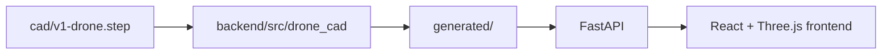

# Architecture

## Current Architecture

The repository now has separate backend, frontend, CAD-source, generated-output,
documentation, and script boundaries.



Implemented foundation:

- `cad/`: source CAD files.
- `backend/`: Python package for CAD import, analysis, export, and API code.
- `frontend/`: React and TypeScript app.
- `generated/`: reproducible local outputs ignored by Git except `.gitkeep`.
- `docs/`: versioned documentation.
- `scripts/`: repository utility scripts.

## CAD Boundary

Initial CAD work uses Python with CadQuery and OCP/Open CASCADE bindings.
Code outside the CAD package should consume normalized project data instead of
direct CadQuery or Open CASCADE objects.

Target interface:

```python
class CadProcessor:
    def import_assembly(self, path: str): ...
    def calculate_mass_properties(self, assembly, materials): ...
    def create_render_mesh(self, assembly): ...
```

If a C++ Open CASCADE service is added later, it should preserve the normalized
API boundary.

## Data Flow

Planned v0.1.0 data flow:

1. Import and inspect `cad/v1-drone.step`.
2. Normalize parts, units, transforms, warnings, and stable IDs.
3. Apply material density or explicit mass overrides.
4. Calculate part and assembly mass properties.
5. Export render geometry to `generated/v1-drone.glb`.
6. Serve analysis and model metadata from FastAPI.
7. Render the model and engineering properties in the frontend.

## API Structure

Implemented endpoints:

- `GET /health`
- `GET /api/v1/models/v1-drone`
- `GET /api/v1/models/v1-drone/analysis`
- `GET /api/v1/models/v1-drone/geometry.glb`

The API reads generated artifacts from `generated/` when present and regenerates
analysis or GLB output from `cad/v1-drone.step` if local artifacts are missing.
Development CORS is limited to the local Vite frontend origins.

## Coordinate Systems And Units

- Internal calculations use SI units.
- World convention: `+x` right, `+y` forward, `+z` up.
- Three.js also uses `+y` as up by default, so the viewer must document any
  conversion needed for the chosen scene orientation.
- Quaternion conventions are not introduced in this foundation commit.

## Security Considerations

CAD files are untrusted inputs. CAD import services should validate size, type,
units, parse status, topology, and body solidity before using derived values.
Processing should avoid shell command construction from unsanitized paths and
avoid logging proprietary geometry, full meshes, or secrets.
